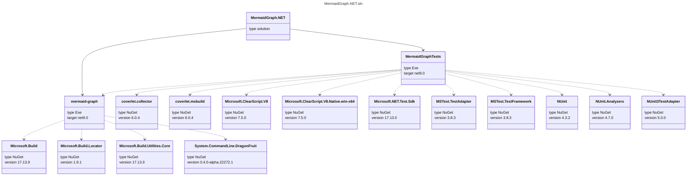

```mermaid
---
title: MermaidGraph.NET.sln
config:
  class:
    hideEmptyMembersBox: true
---
classDiagram
    class MermaidGraph.NET{
        type solution
    }
    MermaidGraph.NET --> mermaid-graph
    class mermaid-graph{
        type Exe
        target net9.0
    }
    class Microsoft.Build{
        type NuGet
        version 17.13.9
    }
    mermaid-graph ..> Microsoft.Build
    class Microsoft.Build.Locator{
        type NuGet
        version 1.9.1
    }
    mermaid-graph ..> Microsoft.Build.Locator
    class Microsoft.Build.Utilities.Core{
        type NuGet
        version 17.13.9
    }
    mermaid-graph ..> Microsoft.Build.Utilities.Core
    class System.CommandLine.DragonFruit{
        type NuGet
        version 0.4.0-alpha.22272.1
    }
    mermaid-graph ..> System.CommandLine.DragonFruit
    MermaidGraph.NET --> MermaidGraphTests
    class MermaidGraphTests{
        type Exe
        target net9.0
    }
    MermaidGraphTests ..> mermaid-graph
    class coverlet.collector{
        type NuGet
        version 6.0.4
    }
    MermaidGraphTests ..> coverlet.collector
    class coverlet.msbuild{
        type NuGet
        version 6.0.4
    }
    MermaidGraphTests ..> coverlet.msbuild
    class Microsoft.ClearScript.V8{
        type NuGet
        version 7.5.0
    }
    MermaidGraphTests ..> Microsoft.ClearScript.V8
    class Microsoft.ClearScript.V8.Native.win-x64{
        type NuGet
        version 7.5.0
    }
    MermaidGraphTests ..> Microsoft.ClearScript.V8.Native.win-x64
    class Microsoft.NET.Test.Sdk{
        type NuGet
        version 17.13.0
    }
    MermaidGraphTests ..> Microsoft.NET.Test.Sdk
    class MSTest.TestAdapter{
        type NuGet
        version 3.8.3
    }
    MermaidGraphTests ..> MSTest.TestAdapter
    class MSTest.TestFramework{
        type NuGet
        version 3.8.3
    }
    MermaidGraphTests ..> MSTest.TestFramework
    class NUnit{
        type NuGet
        version 4.3.2
    }
    MermaidGraphTests ..> NUnit
    class NUnit.Analyzers{
        type NuGet
        version 4.7.0
    }
    MermaidGraphTests ..> NUnit.Analyzers
    class NUnit3TestAdapter{
        type NuGet
        version 5.0.0
    }
    MermaidGraphTests ..> NUnit3TestAdapter
```

