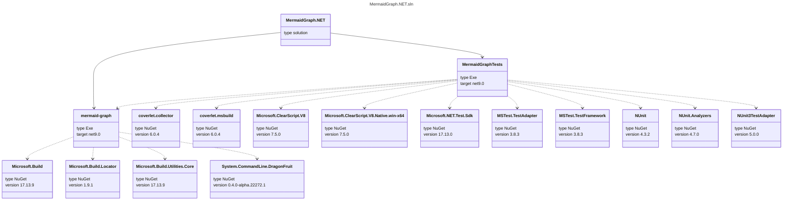

# MermaidGraph.NET 

Create a mermaid graph of the dependency diagram for a project, or whole solution.

## Dotnet tool [](https://www.nuget.org/packages/mermaid-graph/)

You can install as a dotnet tool so you can easily map all of your software projects:

`dotnet tool install --global mermaid-graph`

## Usage
```
Description:
  Outputs a mermaid graph of the dependency diagram for a project, or whole solution.

Usage:
  mermaid-graph [options]

Options:
  --path <path>         Full path to the solution (*.sln) or project (*.csproj) file that will be mapped.
  --type <Class|Graph>  The type of diagram to generate (e.g., Graph or Class). [default: Graph]
  --filter <filter>     Exclude projects whose name matches the filter. (e.g., Test) []
  --version             Show version information
  -?, -h, --help        Show help and usage information
```

## Example output from this solution

You can run the following command to generate a class diagram for this solution:

```powershell
.\mermaid-graph.exe --path "MermaidGraph.NET.sln" --type Class
```

This will generate a mermaid graph in the console output, which can be piped to a file and used in a markdown document.


