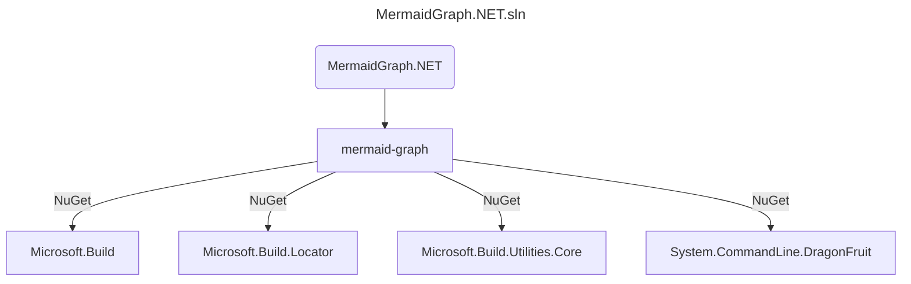

# MermaidGraph.NET
 Create a mermaid graph of the dependency diagram for a project, or whole solution.

## Example

```mermaid
---
title: MermaidGraph.NET.sln
---
graph TD
    s34640832(MermaidGraph.NET) --> mermaid-graph
    mermaid-graph -->|NuGet| Microsoft.Build
    mermaid-graph -->|NuGet| Microsoft.Build.Locator
    mermaid-graph -->|NuGet| Microsoft.Build.Utilities.Core
    mermaid-graph -->|NuGet| System.CommandLine.DragonFruit
```