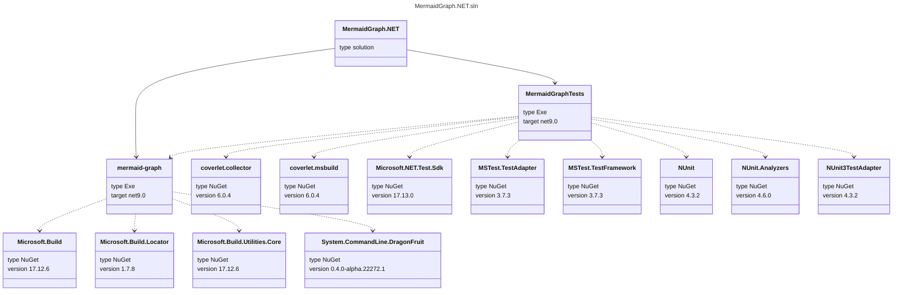

# MermaidGraph.NET
Create a mermaid graph of the dependency diagram for a project, or whole solution.

## Dotnet tool [](https://www.nuget.org/packages/mermaid-graph/)

You can install as a dotnet tool so you can easily map all of your software projects:

`dotnet tool install --global mermaid-graph`

## Usage
```
Description:
  Outputs a mermaid graph of the dependency diagram for a project, or whole solution.

Usage:
  mermaid-graph [options]

Options:
  --path <path>   Full path to the solution (*.sln) or project (*.csproj) file that will be mapped.
  --version       Show version information
  -?, -h, --help  Show help and usage information
  ```

## Example output from this solution


